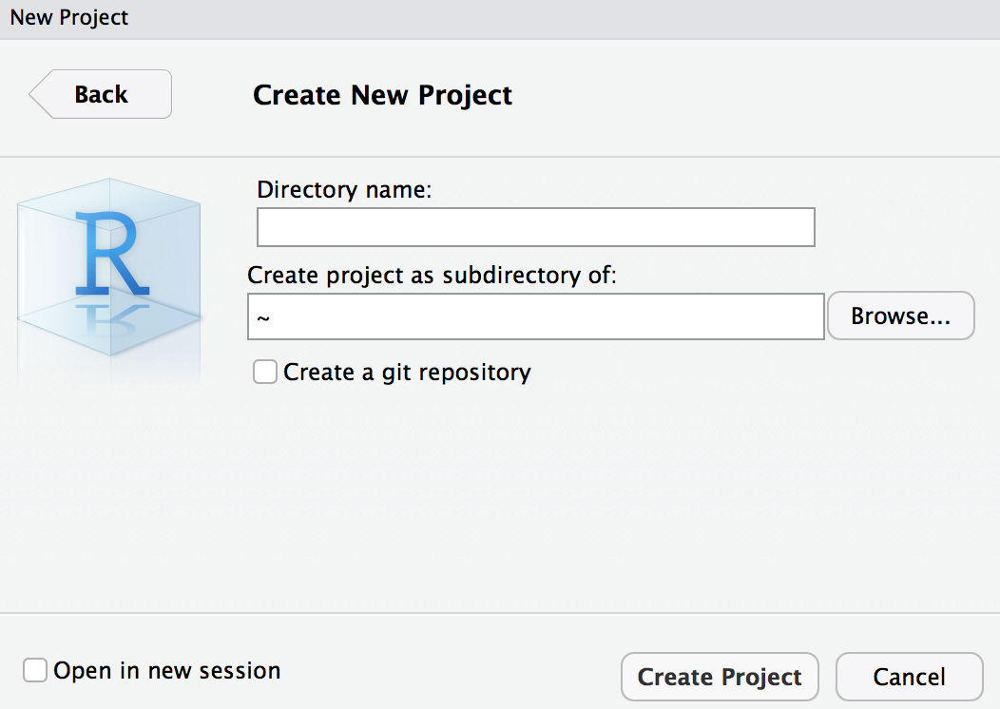

## How to render an `RMarkdown` script online

### Instructions
1. In RStudio go to `File` > `New Project...` > `New Directory` > `New Project`
2. Give your project a name and specify the path where it should be saved

